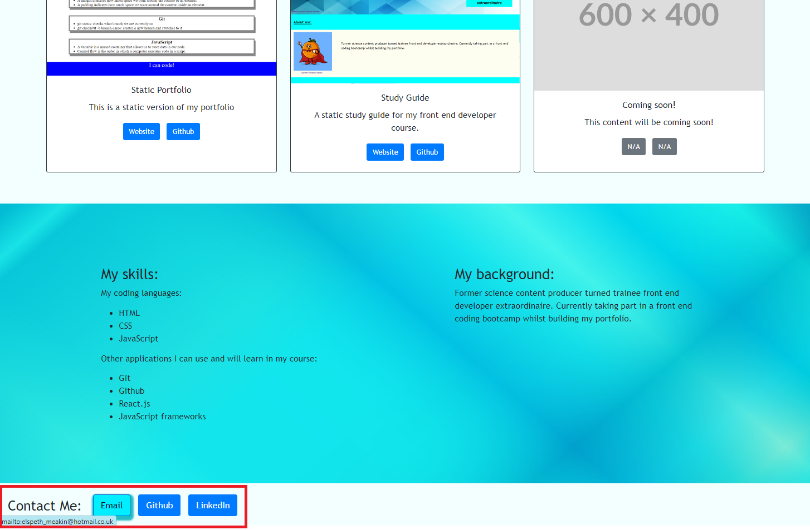

# Elspeth-Meakin-s-Bootstrap-Portfolio

## Description

This is a bootstrap version of my profile for a more adaptable website minimising the need for media queries. It will showcase my past front end development projects, as well as providing my contact information. There will be an image or avatar of myself, and active links to both the website and their respective GitHub repositories. As new projects are completed, they will be added to this webiste, as well as the newest CV. This webiste is also adaptive to different screen sizes.

## Usage

The website will contain a bootstrap navigation bar which will link to the corresponding parts of the website.

The website has a hero section with my picture, my name, and other information about me.

The website has a work section which has my past work displayed using bootstrap cards in a grid.

The website has a section which lists my current and future skills, and more information about me.

There is a footer section with contact buttons which display hover effects.

## License

MIT